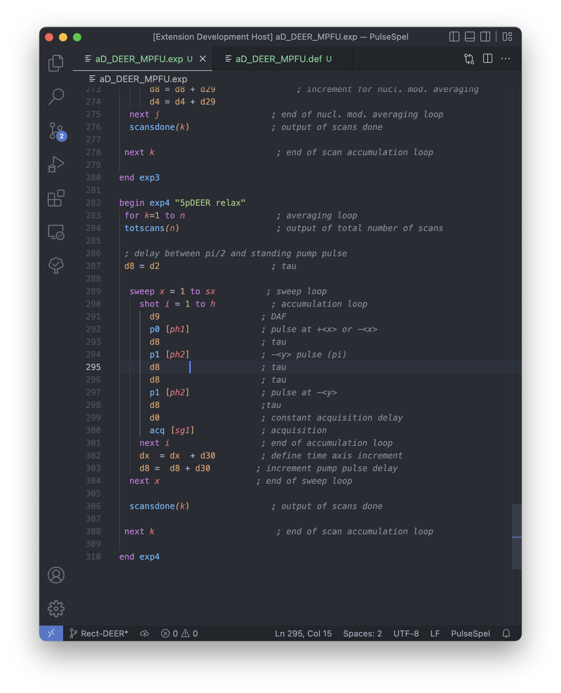

This extension provides synatax highlighting for BRUKER's EPR experiment programing language: PulseSpel. 
## Features

When working with ".def" and ".exp" files, variable names, functions, control words etc... are highlighted acording to your current VScode theme.
Some Examples

> Tip: Many popular extensions utilize animations. This is an excellent way to show off your extension! We recommend short, focused animations that are easy to follow.

## Known Issues

Calling out known issues can help limit users opening duplicate issues against your extension.

## Release Notes

### 1.0.0

Initial release: Provides basic syntax highlighting. 

